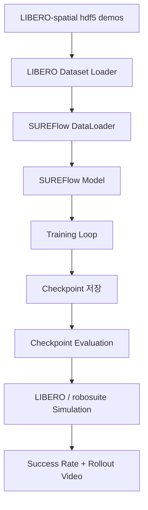

# SUREFlow + LIBERO 실습 튜토리얼

이 저장소는 WSL2 Ubuntu 환경에서 SUREFlow를 LIBERO-spatial 데이터셋으로 학습하고, checkpoint 평가 및 rollout 영상 저장까지 확인한 실습 과정을 정리한 튜토리얼입니다.

## 실습 목표

```text
LIBERO-spatial dataset
→ SUREFlow model training
→ checkpoint 저장
→ LIBERO simulation evaluation
→ rollout video 저장 및 success rate 확인
```

## 실습 환경

| 항목 | 내용 |
|---|---|
| OS | Windows + WSL2 Ubuntu 22.04 |
| Conda env | `libero` |
| Project path | `~/projects/SUREFlow` |
| Dataset path | `~/datasets/robot/libero_spatial` |
| Training suite | `libero_spatial` |
| Python | 3.8 |
| PyTorch | 2.4.1 + CUDA 12.1 |

## 현재까지 확인한 결과

1. SUREFlow 설치 및 import 성공
2. `causal-conv1d`, `mamba-ssm` 설치 성공
3. Python 3.8 타입 힌트 호환성 패치 적용
4. LIBERO-spatial 데이터셋 로딩 성공
5. mini subset 학습 성공
6. 전체 데이터 1 epoch 학습 성공
7. checkpoint 저장 성공
8. checkpoint 기반 LIBERO evaluation 성공
9. rollout 영상 저장 확인
10. 전체 데이터 1 epoch checkpoint 평가에서 1회 성공 확인
11. 현재 전체 데이터 3 epoch 학습 실험 진행

## 주요 문서

- [전체 실습 가이드](docs/sureflow_libero_tutorial.md)
- [실험 로그 정리](results/experiment_log.md)
- [수정한 코드 패치 정리](patches/README.md)
- [프로젝트 구조 설명](docs/project_structure.md)

## 실행 흐름 요약



## 기본 실행 명령어

### 학습만 실행

```bash
cd ~/projects/SUREFlow
conda activate libero
WANDB_MODE=disabled python run.py --train_suite libero_spatial
```

### checkpoint로 평가만 실행

```bash
WANDB_MODE=disabled python run.py \
  --train_suite libero_spatial \
  --checkpoint_path /home/ubuntu/projects/SUREFlow/logs/.../checkpoints/final_model.pth
```

## 주의 사항

- 기존 checkpoint 파일이 있어도 자동으로 evaluation으로 가지 않습니다.
- `--checkpoint_path`를 넣었을 때만 기존 checkpoint를 불러와 평가합니다.
- 전체 데이터 학습 시에는 학습 후 자동 evaluation을 막는 것이 안전합니다.
- 평가 단계는 robosuite / MuJoCo simulation이 포함되어 RAM 사용량이 큽니다.
- WSL2 RAM이 부족하면 `wsl --shutdown` 후 다시 실행하는 것이 좋습니다.

## 영상 저장 위치

평가 영상은 일반적으로 다음 경로 아래 저장됩니다.

```text
logs/<project>/<mode>/<run_id>/checkpoints/eval_videos/
```

확인 명령어:

```bash
find ~/projects/SUREFlow/logs -type f -name "*.mp4" | tail
```
