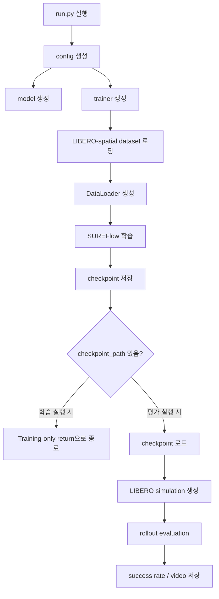

# 프로젝트 구조 설명

이 문서는 SUREFlow 실습에서 실제로 수정하거나 확인한 주요 파일의 역할을 정리한다.

## 전체 구조

```text
~/projects/SUREFlow
├── run.py
├── configs/
│   ├── config.py
│   └── factory.py
├── SUREFlow/
│   ├── main.py
│   └── ...
├── dataloader/
│   ├── libero_dataset.py
│   ├── libero_sim.py
│   └── video_paths.py
├── LIBERO-PRO/
├── logs/
│   └── SUREFlow_demo70_FiLM/
│       └── LO_E400_B256_TS100k/
│           └── <run_id>/
│               ├── checkpoints/
│               │   ├── final_model.pth
│               │   └── eval_videos/
│               ├── config.py
│               ├── logs/
│               ├── visuals/
│               └── wandb/
└── assets/
```

## 핵심 실행 흐름



## `run.py`

전체 실행의 entry point이다.

주요 역할:

```text
1. config 생성
2. wandb 설정
3. run directory 생성
4. model 생성
5. trainer 생성
6. checkpoint가 없으면 학습
7. checkpoint가 있으면 로드 후 평가
8. simulation evaluation 실행
```

실습에서는 전체 데이터 학습 후 바로 evaluation으로 들어가지 않도록 `trainer.main(model)` 아래에 `return`을 추가했다.

수정 전:

```python
else:
    trainer.main(model)

env_sim = create_simulation(cfg)
env_sim.configure_visuals(cfg.visuals, visuals_testing_dir)
env_sim.test_model(model, cfg.model_cfg, epoch=cfg.epoch)
```

수정 후:

```python
else:
    trainer.main(model)

    log.info("Training-only mode: skipping simulation evaluation.")
    log.info("state_dict saved in {}".format(model.working_dir))

    if run is not None:
        wandb.finish()

    return

env_sim = create_simulation(cfg)
env_sim.configure_visuals(cfg.visuals, visuals_testing_dir)
env_sim.test_model(model, cfg.model_cfg, epoch=cfg.epoch)
```

이 구조에서는 다음처럼 동작한다.

```text
python run.py --train_suite libero_spatial
→ 새 학습 실행 후 checkpoint 저장, evaluation 생략

python run.py --train_suite libero_spatial --checkpoint_path <path>
→ checkpoint 로드 후 evaluation 실행
```

## `configs/config.py`

실험 설정값을 관리한다.

주로 수정한 항목:

```python
EPOCHS = 1 또는 3
TRAIN_BATCH_SIZE = 2
VAL_BATCH_SIZE = 2
rollouts = 1 또는 3
save_video = True
render_image = False
use_multiprocessing = False
```

실습 중 전체 데이터 1 epoch 학습 설정:

```python
EPOCHS = 1
TRAIN_BATCH_SIZE = 2
VAL_BATCH_SIZE = 2
```

현재 확장 실험 설정:

```python
EPOCHS = 3
TRAIN_BATCH_SIZE = 2
VAL_BATCH_SIZE = 2
```

## `SUREFlow/main.py`

trainer와 DataLoader 구성이 포함된 파일이다.

### Mini subset 실험

처음에는 아래처럼 mini subset을 DataLoader에만 적용했다.

```python
from torch.utils.data import Subset

max_train_samples = 1000

trainset_for_loader = self.trainset
if len(self.trainset) > max_train_samples:
    trainset_for_loader = Subset(self.trainset, range(max_train_samples))
    logging.info(f"Using mini train subset: {max_train_samples} samples")
```

주의:

```text
self.trainset 자체를 Subset으로 바꾸면 안 된다.
scaler 설정에서 self.trainset.get_all_actions()가 필요하다.
```

### 전체 데이터 학습

전체 데이터 학습으로 전환할 때는 subset 코드를 제거하고 아래처럼 설정했다.

```python
def _setup_data_loaders(self):
    trainset_for_loader = self.trainset

    self.train_dataloader = DataLoader(
        trainset_for_loader,
        batch_size=self.train_batch_size,
        shuffle=True,
        num_workers=1,
        pin_memory=False,
        drop_last=True,
        persistent_workers=True,
        prefetch_factor=2
    )
```

안정성이 필요하면 다음처럼 낮춘다.

```python
self.train_dataloader = DataLoader(
    trainset_for_loader,
    batch_size=self.train_batch_size,
    shuffle=True,
    num_workers=0,
    pin_memory=False,
    drop_last=True,
    persistent_workers=False,
    prefetch_factor=None
)
```

## `dataloader/libero_sim.py`

LIBERO / robosuite 평가를 담당한다.

주로 수정한 항목:

```python
if self.benchmark_type == "libero_90":
    num_tasks = 1
else:
    num_tasks = 1
```

이렇게 하면 evaluation task 수를 1개로 줄일 수 있다.

평가 전체 episode 수는 다음처럼 결정된다.

```text
Total Evaluations = num_tasks × rollouts
```

예:

```text
num_tasks = 1
rollouts = 3
→ Total Evaluations = 3
```

## `dataloader/video_paths.py`

evaluation video 저장 경로를 만드는 파일이다.

실행 시 다음 로그가 뜨면 영상 저장 경로가 설정된 것이다.

```text
Evaluation videos will be saved under .../checkpoints/eval_videos
```

## `logs/`

학습 및 평가 결과가 저장된다.

예시:

```text
logs/SUREFlow_demo70_FiLM/LO_E400_B256_TS100k/20260702_135954/
├── checkpoints/
│   ├── final_model.pth
│   └── eval_videos/
├── config.py
├── logs/
├── visuals/
└── wandb/
```

중요 파일:

```text
checkpoints/final_model.pth
→ 학습된 모델 checkpoint

checkpoints/eval_videos/
→ 평가 rollout 영상

config.py
→ 해당 run에서 사용한 config 복사본
```

## WSL에서 확인한 구조

사용자는 Windows 파일 탐색기와 VS Code WSL explorer를 통해 다음을 확인했다.

```text
~/projects/LIBERO
~/projects/SUREFlow
~/projects/SUREFlow/logs/.../checkpoints/eval_videos
```

VS Code에서는 `.mp4`가 바로 열리지 않을 수 있다. 이 경우 Windows 파일 탐색기 또는 외부 동영상 플레이어로 확인한다.
